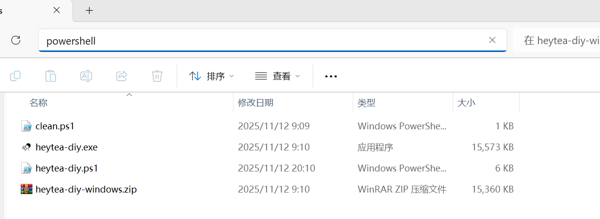
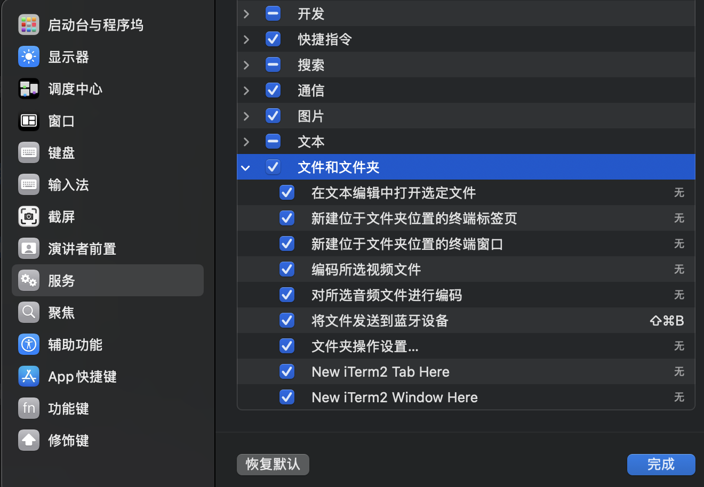
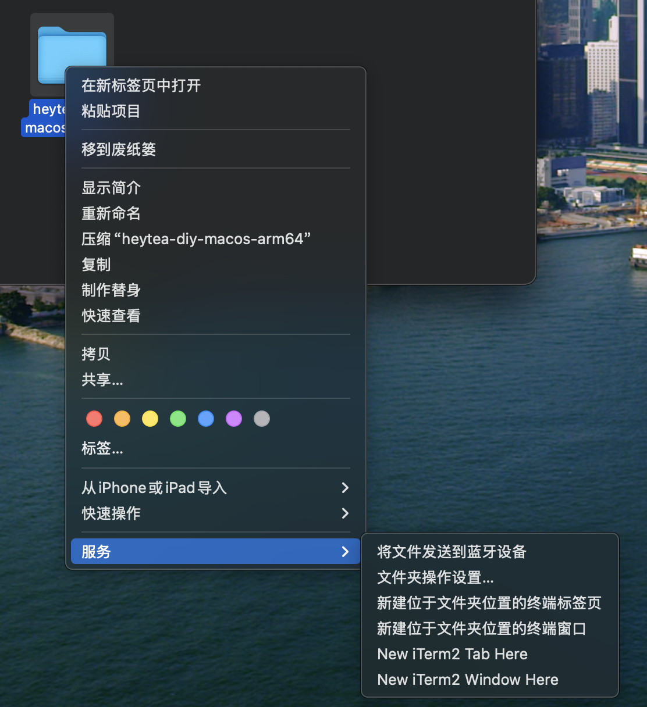
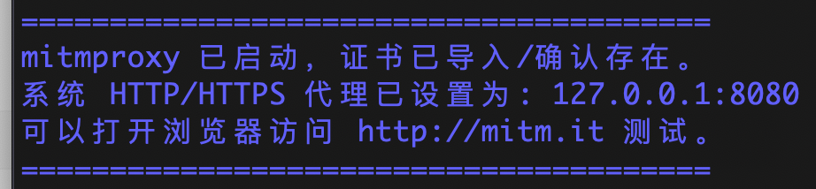
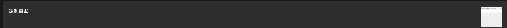
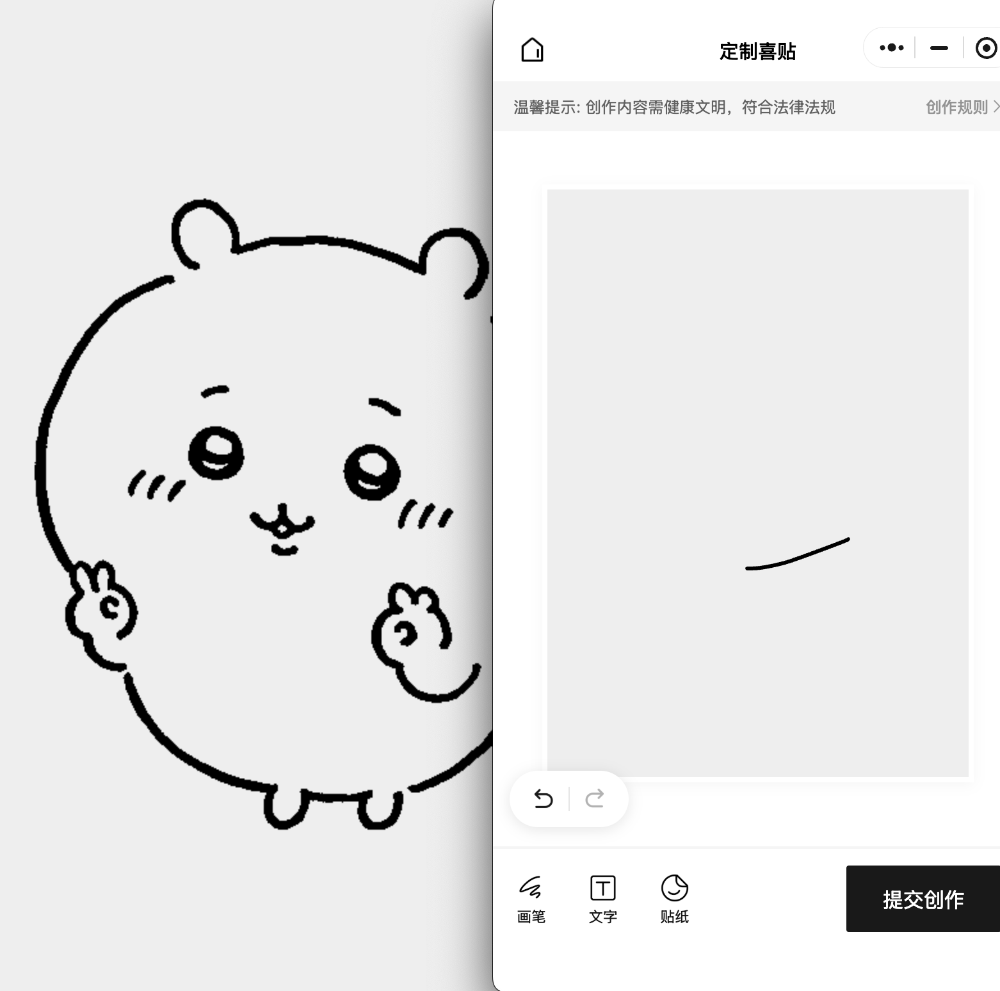

## 一、Windows 使用教程

### 1. 包含的文件

从 GitHub Release 下载并解压后，目录中应包含：

* `heytea-diy.exe`
* `heytea-diy.ps1`
* `clean.ps1`

### 2. 配置代理

#### 2.1 以管理员身份打开 PowerShell

在文件夹上方输入 `powershell` 按回车打开 PowerShell。



在弹出的终端中输入以下命令，以管理员身份打开 PowerShell：

```powershell
Start-Process PowerShell -Verb RunAs "-noexit -command Set-Location -LiteralPath `"$pwd`""
```

#### 2.2 允许执行本地脚本（如果第一次运行）

如果从未在这台机器上跑过自定义脚本，可能需要先执行（只需一次）：

```powershell
Set-ExecutionPolicy RemoteSigned -Scope CurrentUser
```

根据提示选择 `Y`。

#### 2.3 启动代理并自动配置（默认端口 8080）

在放置文件的目录中执行：

```powershell
cd C:\tools\heytea-diy\
.\heytea-diy.ps1
```

> 脚本会做这些事情：
>
> 1. 检查是否管理员权限；
> 2. 启动 `heytea-diy.exe`（内部跑 mitmproxy）；
> 3. 等待 mitmproxy 生成 CA 证书 `~\.mitmproxy\mitmproxy-ca-cert.cer`；
> 4. 如果证书还没导入过：
>
> 	* 调用 `certutil` 自动导入到 **“本地计算机 → 受信任的根证书颁发机构 (Root)”**；
> 5. 将系统代理设置为：
>
> 	* HTTP/HTTPS 代理：`127.0.0.1:8080`
> 	* 生效范围：WinINET（浏览器、绝大多数桌面程序）+ WinHTTP（部分服务 / CLI）。

控制台最后会提示类似：

```text
mitmproxy 已启动，证书导入完成，系统代理已开启。
当前代理：127.0.0.1:8080
可以在浏览器访问 http://mitm.it 测试。
```

脚本支持命名参数 `-p`，例如想使用 **9000 端口**：

```powershell
.\heytea-diy.ps1 -p 9000
```

#### 2.4 验证是否生效

等待一段时间后，打开浏览器访问：

```text
http://mitm.it
```

能看到 mitmproxy 的提示页面，就说明代理生效。

---

### 3. 上传杯贴

**准备图片**

将要上传的图片尺寸更改为 `596x832`，转换为 png 格式，并确保大小小于 200KB。将图片名称改为 target.png 并移动到**程序所在目录**。

**小程序点击上传**

在手机上提前收藏杯贴自定义页面，以便能够在电脑端打开。在电脑上打开小程序，进入绘制界面，随便绘制内容，并点击提交。如果配置正确，提交的内容已被替换。

---

### 4. 关闭代理（重要！！）

当你不再需要代理时，可以执行关闭脚本：

```powershell
\clean.ps1
```

> 脚本会：
>
> * 关闭 WinINET 的代理开关；
> * 将 WinHTTP 代理重置为默认；
> * **注意**：默认只关“代理配置”，不会强制结束 `heytea-diy.exe` 进程（需要的话可以在任务管理器手动结束）。

---

### 5. 常见问题

1. **脚本提示无法执行（ExecutionPolicy 错误）**
   请用管理员 PowerShell 执行一次：

   ```powershell
   Set-ExecutionPolicy RemoteSigned -Scope CurrentUser
   ```
2. **第一次导入证书时弹出安全提示**
   确认证书颁发者为 `mitmproxy`，并选择允许信任即可。
3. **浏览器依旧不走代理**

   * 检查浏览器是否设置了“不要使用系统代理”（特别是 Firefox）。
   * 确认 `heytea-diy.ps1` 中端口和你实际访问的端口一致。

---

## 二、macOS 使用教程

### 1. 包含的文件

从 GitHub Release 下载并解压后，macOS 目录中应包含：

* `heytea-diy`
* `heytea-diy.sh`
* `clean.sh`

---

### 2. 赋予执行权限（只用一次）

#### 启用“服务”菜单中的「在终端中打开」（若之前没有设置过）

#### 步骤：

1. 打开「系统设置」或「系统偏好设置」

2. 前往：

   ```
   键盘 → 快捷键 → 服务（Services）
   ```

3. 在右侧找到：

   ```
   “文件与文件夹” → ✅ 勾选“在终端中打开”
   ```



#### 使用方式：

1. 打开 Finder
2. 选中你想打开的文件夹（如“应用程序”）
3. **右键 → 服务 → 在终端中打开**



剩下都在这个终端中操作即可。

在文件夹中右键打开终端，输入：

```bash
chmod +x heytea-diy
chmod +x start_mitmproxy_with_env_mac.sh
chmod +x stop_mitmproxy_proxy_mac.sh  # 如果有的话
```

---

### 3. 配置代理

在终端使用 sudo 运行启动脚本（默认端口 8080）：

```bash
sudo ./heytea-diy.sh
```

> 脚本会执行：
>
> 1. 检查是否 root（sudo）；
> 2. 启动 `./heytea-diy -p 8080`（后台运行）；
> 3. 等待 mitmproxy 在 `/var/root/.mitmproxy/` 下生成 CA 证书；
> 4. 如果 System.keychain 中还没有 `mitmproxy` 证书：
>
> 	* 用 `security add-trusted-cert` 导入到 **系统钥匙串 (System.keychain)**，设为受信任根证书；
> 	* 可能会弹出 GUI 确认框，需要你手动点“始终信任”；
> 5. 对所有启用的网络服务（Wi-Fi、有线等）执行：
>
> 	* `networksetup -setwebproxy <服务> 127.0.0.1 8080`
> 	* `networksetup -setsecurewebproxy <服务> 127.0.0.1 8080`
> 	* 并打开 HTTP/HTTPS 代理开关。

---



如想使用其他端口，如 9000 端口，可使用命名参数：

```bash
sudo ./heytea-diy.sh -p 9000
```

### 4. 上传杯贴

**准备图片**

将要上传的图片尺寸更改为 `596x832`，转换为 png 格式，并确保大小小于 200KB。将图片名称改为 target.png 并移动到**程序所在目录**。

**小程序点击上传**

手机在杯贴自定义页面点击右上角按钮后，点击收藏，以便能够在电脑端打开。


****

在电脑上打开小程序，进入绘制界面，随便绘制内容，并点击提交。如果配置正确，点击提交创作后，提交的内容已被替换。如下图所示






### 5. 验证是否生效

打开浏览器访问：

```text
http://mitm.it
```

如果能看到 mitmproxy 页面，说明代理和证书都已经生效。

---

### 6. 关闭代理（重要！！）

执行关闭脚本：

```bash
sudo ./clean.sh
```

---

### 7. 常见问题

1. **提示无法打开“因为来自身份不明的开发者”**
* 第一次运行二进制时，可能需要在「系统设置 → 隐私与安全性」里允许一次。可参考[在 Mac 上安全地打开 App - 官方 Apple 支持 (中国)](https://support.apple.com/zh-cn/102445)设置
2. **证书导入时弹出 GUI 提示**
   * 选择“始终信任” / “总是允许”即可；
   * 如多次弹出，请确认脚本使用的是 System.keychain，而不是登录钥匙串。

